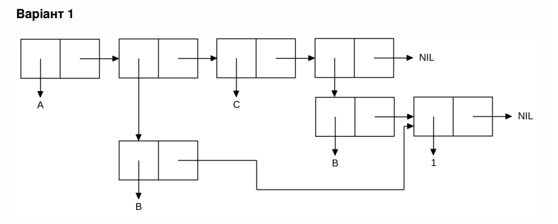

<p align="center"><b>МОНУ НТУУ КПІ ім. Ігоря Сікорського ФПМ СПіСКС</b></p>

<p align="center">
<b>Звіт з лабораторної роботи 1</b><br/>
"Обробка списків з використанням базових функцій"<br/>
дисципліни "Вступ до функціонального програмування"
</p>

<p align="right">Студент: Абраменко Данило Олександрович КВ-13<p>
<p align="right">Рік: 2024<p>


  ## Загальне завдання 

  ### Пункт 1
  Створіть список з п'яти елементів, використовуючи функції LIST і CONS . Форма
створення списку має бути одна — використання SET чи SETQ (або інших
допоміжних форм) для збереження проміжних значень не допускається. Загальна
кількість елементів (включно з підсписками та їх елементами) не має перевищувати
10-12 шт. (дуже великий список робити не потрібно). Збережіть створений список у
якусь змінну з SET або SETQ . Список має містити (напряму або у підсписках):

- хоча б один символ

- хоча б одне число

- хоча б один не пустий підсписок

- хоча б один пустий підсписок

#### Пункт 2
  Отримайте голову списку.
#### Пункт 3
  Отримайте хвіст списку.
#### Пункт 4
  Отримайте третій елемент списку.
#### Пункт 5
  Отримайте останній елемент списку.
#### Пункт 6
  Використайте предикати ATOM та LISTP на різних елементах списку (по 2-3
приклади для кожної функції).
#### Пункт 7
  Використайте на елементах списку 2-3 інших предикати з розглянутих у розділі 4
навчального посібника.
#### Пункт 8
  Об'єднайте створений список з одним із його непустих підсписків. Для цього
використайте функцію APPEND .
  
```lisp 
;;Пункт 1
(defvar taskone-list nil)
(setq taskone-list (list 'A (list 'B) 'C (list 'B 1) nil))
(format t "Task 1: ~a~%" taskone-list)

;;Пункт 2
(defvar head nil)
(setq head (first taskone-list))
(format t "Task 2: Head of the list: ~a~%" head)

;;Пункт 3
(defvar tail nil)
(setq tail (cdr taskone-list))
(format t "Task 3: Tail of the list: ~a~%" tail)

;;Пункт 4
(defvar third-element nil)
(setq third-element (nth 2 taskone-list))
(format t "Task 4: Third element: ~a~%" third-element)

;;Пункт 5
(defvar last-element nil)
(setq last-element (first (last taskone-list)))
(format t "Task 5: Last element: ~a~%" last-element)

;;Пункт 6
(format t "Is first element an atom? ~a~%" (atom (first taskone-list)))
(format t "Is second element an atom? ~a~%" (atom (nth 1 taskone-list)))
(format t "Is first element a list? ~a~%" (listp (first taskone-list)))
(format t "Is second element a list? ~a~%" (listp (nth 1 taskone-list)))

;;Пункт 7
(format t "Is fourth element equal to '(B 1)? ~a~%" (equal (nth 3 taskone-list) '(B 1)))
(format t "Is third element equal to 'C? ~a~%" (eq (nth 2 taskone-list) 'C))
(format t "Is last element null? ~a~%" (null last-element))

;;Пункт 8
(defvar sublist (nth 3 taskone-list))
(defvar combined-list (append taskone-list sublist))
(format t "Task 8: Combined list: ~a~%" combined-list)
```

#### Результати тестування

```lisp 
Task 1: (A (B) C (B 1) NIL)
Task 2: Head of the list: A
Task 3: Tail of the list: ((B) C (B 1) NIL)
Task 4: Third element: C
Task 5: Last element: NIL
Is first element an atom? T
Is second element an atom? NIL
Is first element a list? NIL
Is second element a list? T
Is fourth element equal to '(B 1)? T
Is third element equal to 'C? T
Is last element null? T
Task 8: Combined list: (A (B) C (B 1) NIL B 1)
```

## Варіант 3
<p align="center">

</p>

```lisp
(defvar sublist1 (list 'B 1))
(defvar main-list nil)
(setq main-list (list 'A sublist1 'C sublist1))
(format t "Main List: ~a~%" main-list)
```

#### Результати тестування
```lisp 
Main List: (A (B 1) C (B 1))
```
